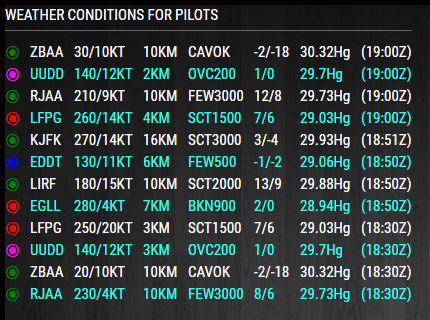
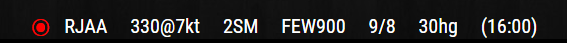

# MMM-PilotWX

## Weather conditions for International Airports

* Monitor a variable number of ICAO's in static or rotating display

* Designed to be usable in all regions

* Layout as per actual pilot's recommendations

* Standard or Alternative colored icon for Flight Rules

## Examples

* Static config option

 

* Rotating config option for bottom_bar or top_bar. You could also try the thirds.

 

Color any way you like. Make it your own.

## Installation of module and dependencies

* `git clone https://github.com/mykle1/MMM-PilotWX.git` into `~/MagicMirror/modules` directory.
* `npm install` in your `~/MagicMirror/modules/MMM-PilotWX` directory.

## Add to Config.js

    {
		disabled: false,
		module: "MMM-PilotWX",
		position: "top_left",         // for mode: "Static",  bottom_bar for mode: "Rotating",
		config: {
			ICAO: "KJFK,EGLL,UUDD,EDDT,RJAA,ZBAA,LFPG,LIRF", // list of INTL ICAO's
			colorCode: "Alternative", // Standard or Alternative
			mode: "Static",           // Static (List) or Rotating (one by one)
			sym: "@",                 // @ or / (Separator for Wind speed and direction)
			tempUnits: "C",		   // C or F (F converted from C)
			measure: "SM",            // SM or KM (KM converted from SM data)
			time: "Local",            // Zulu or Local (observation time)
			maxWidth: "100%",         // 100% for mode: Rotating, approx 300px for mode: Static
			useAltHeader: true,	  // Use alternative header
			useHeader: false,
			header: "",
		}
	},

## Don't hang your MagicMirror in the cockpit!

I feel obliged to state that this module should only be used for entertainment purposes. Yes, the data is being pulled from the very same sites that you use ordinarily, but the thought of any of you relying on this module’s data for actual flights scares the shit out of me. Not that you would. You’re pilots. You’re smarter than that, I hope. :-)

